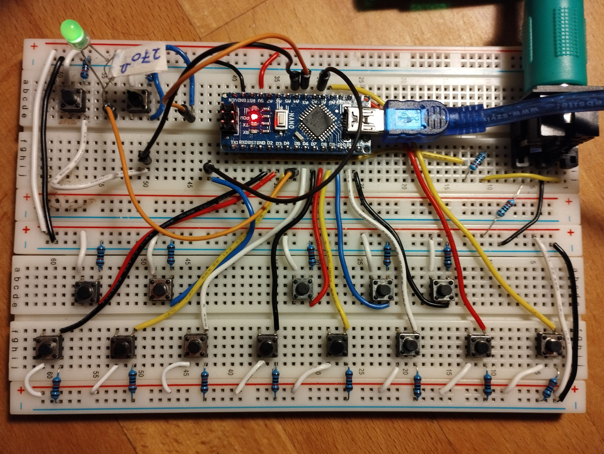
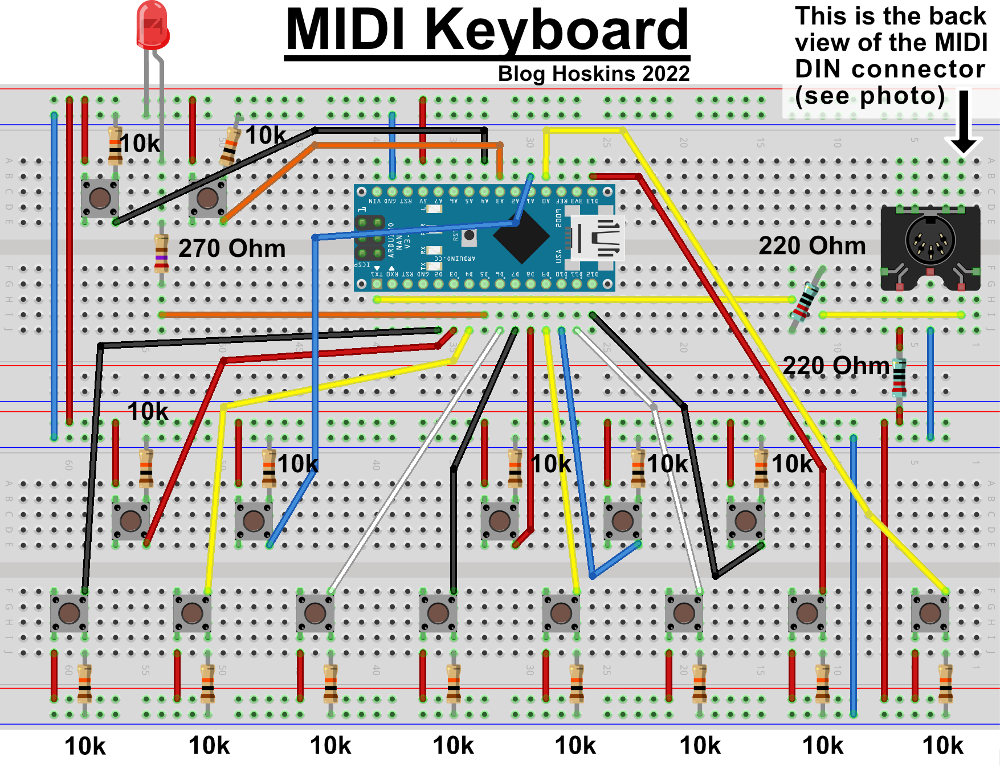

"# DIY-MIDI-Keyboard" 

Code explaination here;

https://bloghoskins.blogspot.com/2022/05/diy-midi-keyboard.html

You'll need;

15x   Push buttons (push to make type)
15x   10k Ohm resistor
2x     220 Ohm resistor
1x     270 Ohm resistor
1x     LED
1x     Arduino Nano
1x     MIDI DIN Connector

