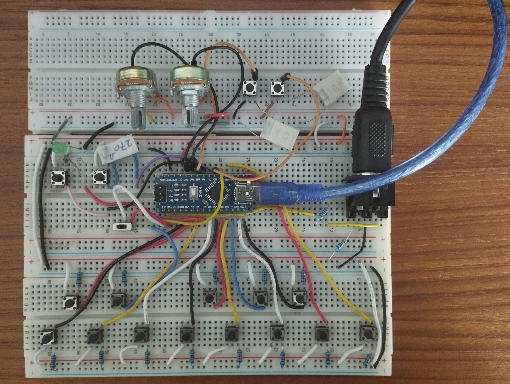

# DIY-MIDI-Keyboard 
_____________________________________________________________________

See further down for Arp version.

MIDI Keyboard

You'll need;

15x   Push buttons (push to make type) 
15x   10k Ohm resistor 
2x     220 Ohm resistor 
1x     270 Ohm resistor 
1x     LED 
1x     Arduino Nano 
1x     MIDI DIN Connector 

_____________________________________________________________________

# MIDI Keyboard With Arpeggiator

https://bloghoskins.blogspot.com/2022/07/midi-keyboard-plus-arpeggiator.html

Features;

Pot for tempo 
Pot for velocity 
Button with 5 Arp-modes 
Arp stop button 
Keyboard Octave Buttons with responsive LED brightness 
Switch to chose between keyboard and ARP mode   

Note: to upload code to the board, you'll need the switch set to the left (aka keyboard mode)

You'll need;

17x   Push buttons (push to make type) 
17x   10k Ohm resistor 
2x     220 Ohm resistor 
1x     270 Ohm resistor 
1x     LED 
1x     Arduino Nano 
1x     MIDI DIN Connector 
2x     Pots  
1x     on/off switch 

